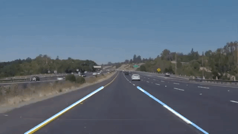

## Finding Lane Lines on the Road

This is the first project of Udacity's Self-Driving Car ND where we detected lane lines in images using Python and OpenCV.

The iPython notebook can be [viewed here](./P1.ipynb). See it in [HTML](./P1.html).

The detection of the lane marking was basically done in five steps:
* **Apply Gaussian filter** to smooth the image in order to remove the noise.
* **Perform canny edge detection:** This step basically detects the edges in the image with the help of the image gradient and hysteresis. Hysteresis finalizes the detection of edges by suppressing all the other edges that are weak and not connected to strong edges.
* **Use hough transformation to find lines from the edges:** Transforms each point to a line in hough space where the intersection of these lines shows the presence of a line in image space
* **Connect the irregular line segments by extrapolating the detected lines**
* In case of videos, maintain a moving average of the endpoints of major line segments for robustness against noise.

[//]: # (Image References)

[image1]: ./sample/image1.png "Grayscale"
[image2]: ./sample/image2.png "Grayscale"
[image3]: ./sample/image3.png "Grayscale"
[image4]: ./sample/image4.png "Grayscale"

---
The above pipeline produces the following images at different steps:

Input Image             |  Blurred
:---------------------:|:-------------------------:
![alt text][image1]  |  ![alt text][image2]

Canny edge detection             |  Hough transformation
:-------------------------:|:-------------------------:
![alt text][image3] |  ![alt text][image4]

### Problems with the basic pipeline

- Too many irregular line segments were detected.
- When processing videos, the detected lane lines would change erratically due to high color, lighting and camera angle variations between subsequent images.

### Possible improvements

#### Connecting the irregular line segments by extrapolating the detected lines
Of all the line segments detected by Hough transform, the length and slope of each segment was calculated. Only the largest segments with slope > 0.5 (left line) and slope < -0.5 were retained.

To extrapolate the largest segments, their intersections were taken with 2 horizontal imaginary lines:
- One passing close to the center of the image
- Another passing through the bottom of the image

#### Stabilizing lane markings
The detected lane lines would change erratically due to variations between successive video frames. To prevent this, moving averages of the endpoints of left and right lines were maintained and plotted through the video.

### Video Outputs

### Video White

### Video Yellow

### Video Challenge

